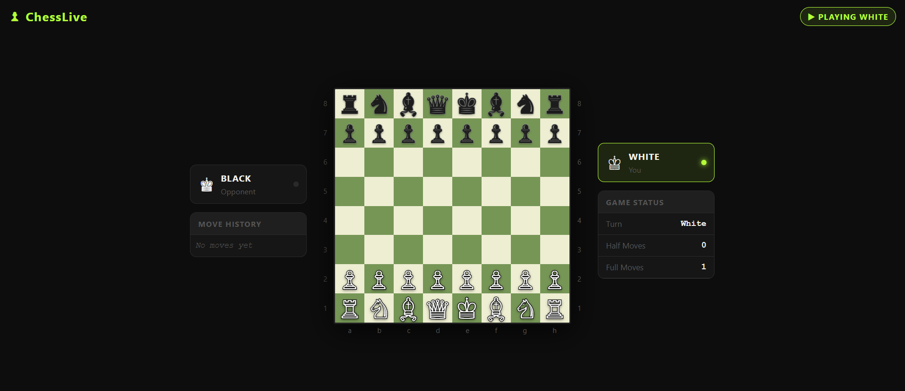

<div align="center">

# ♟️ OnyxChess — Multiplayer Chess

**A real-time multiplayer chess app built with Node.js, Express, Socket.IO, and chess.js.** Two players, one board, zero lag — with full move validation, legal move highlighting, and a spectator mode.

[](https://nodejs.org)
[](https://socket.io)
[](https://github.com/jhlywa/chess.js)
[](https://tailwindcss.com)

</div>

---

## 📸 Preview

> *Dark-themed board with lime accents — real-time moves, legal move hints, and move history*



---

## ✨ Features

- ♟️ **Real-time multiplayer** — two players connect and play live over WebSockets
- ✅ **Full move validation** — server-side legal move enforcement via chess.js, invalid moves are rejected
- 💡 **Legal move highlighting** — click a piece to see valid moves; dots for empty squares, rings for captures
- 🖱️ **Click & drag support** — move pieces by clicking or drag-and-drop
- 🔁 **Board flip** — black's board automatically flips for correct perspective
- 📋 **Move history** — live-updating move log in standard algebraic notation
- 👁️ **Spectator mode** — additional connections join as read-only spectators
- ⚠️ **Check & checkmate alerts** — visual check indicator and toast notifications for game-over states
- 🌑 **Custom dark UI** — Tailwind-based design with a signature black & lime (`#b4ff39`) brand palette
- 📱 **Responsive** — side panels hide on mobile, board fills the screen

---

## 🗂️ Project Structure

```text
Chess/
│
├── public/
│   ├── css/
│   │   └── style.css              # Board, pieces, squares, highlights
│   └── javascript/
│       └── chessgame.js           # Client-side game logic & socket events
│
├── views/
│   └── index.ejs                  # Main HTML shell
│
├── app.js                         # Express + Socket.IO server, move validation
├── package.json
├── package-lock.json
└── preview.png
```

---

## 🏁 Getting Started

```bash
# 1. Clone the repository
git clone https://github.com/Samiullah-2004/OnyxChess.git

# 2. Navigate into the project
cd OnyxChess

# 3. Install dependencies
npm install

# 4. Start the server
node app.js
```

Then open [http://localhost:3000](http://localhost:3000) in your browser.
Open a second tab or browser window to connect as the second player.

---

## 🛠️ Tech Stack

| Technology | Purpose |
|---|---|
| **Express.js** | HTTP server & static file serving |
| **Socket.IO** | Real-time bidirectional communication |
| **chess.js** | Move generation, validation & game state |
| **EJS** | Server-side HTML templating |
| **Tailwind CSS** | Utility-first styling |

---

## 🎮 How It Works

1. First connection is assigned **White**, second is assigned **Black**
2. Any further connections join as **Spectators**
3. Each move is sent to the server via Socket.IO and validated server-side
4. On a valid move the server broadcasts the new board state to all clients
5. Invalid moves are rejected and the client is notified instantly

---

## 👤 Author

**Samiullah Akram**  
Full Stack Developer from Lahore, Pakistan 🇵🇰

[](https://github.com/Samiullah-2004)
[](https://www.linkedin.com/in/samiullah-akram-a28461404/)
[](https://instagram.com/_s_a_m_i_u_l_l_a_h_)
[](mailto:samiullah.akram.3009@gmail.com)

---

## 📄 License

This project is open source and free to use for personal and educational purposes.  
If you use this as a reference or template, a credit would be appreciated! 🙏

---

<div align="center">

**Built with 💚 by Samiullah — 2026**

</div>
